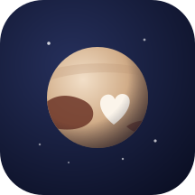
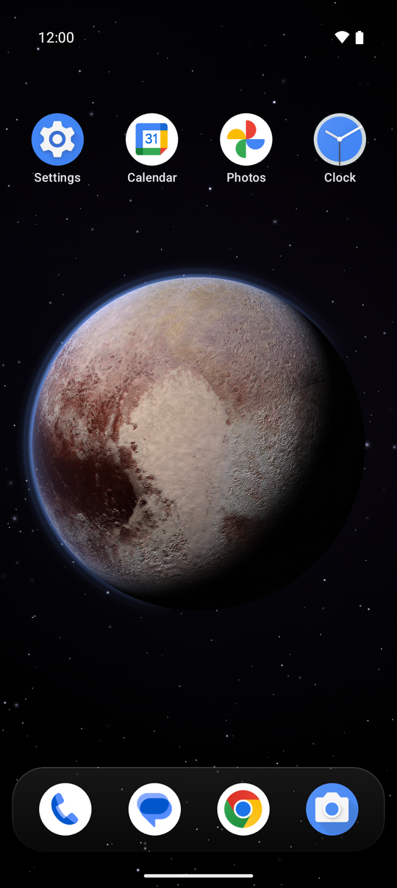
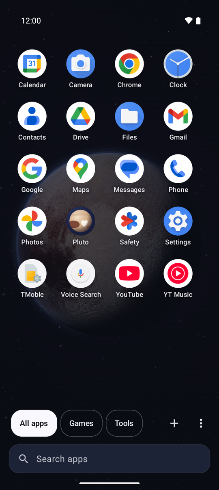
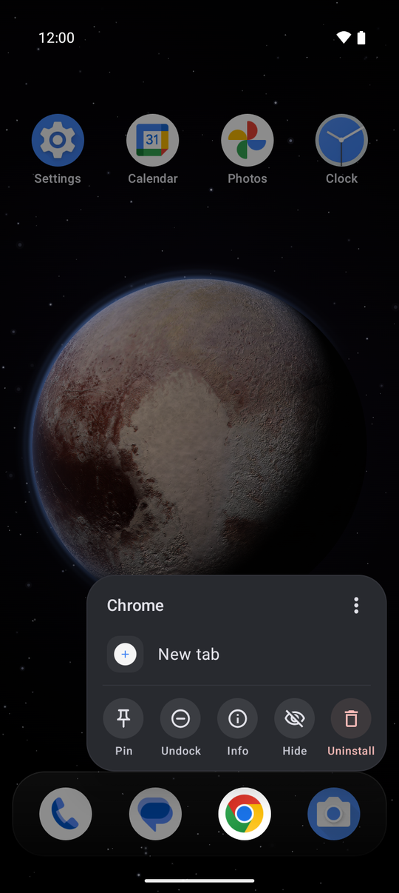
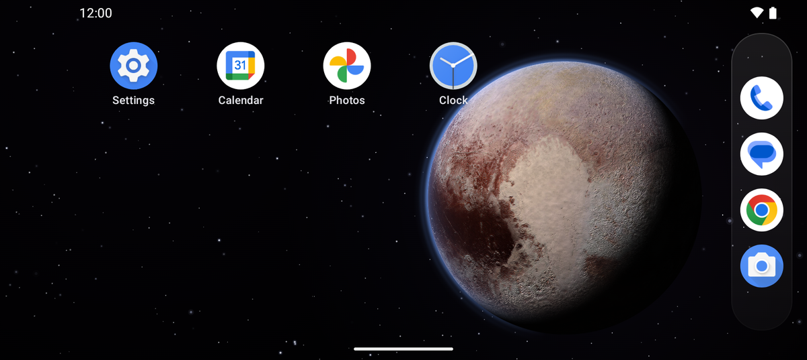
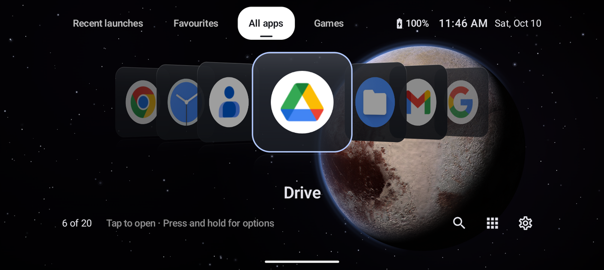

<p align="center">
  
</p>

<h1 align="center">Pluto</h1>

<p align="center">
  <b>One Android home screen for your phone and your handheld.</b><br>
  An everyday launcher in portrait, a comfortable touch layout in landscape,<br>
  and a Coverflow-style console front end when a controller is attached.
</p>

<p align="center">
  <a href="LICENSE"></a>
  
  
  
</p>

---

Pluto is meant to be the one launcher you keep full-time. Rotate the phone or plug in a
gamepad and the presentation adapts, but your apps, favourites, dock, folders and
categories stay exactly the same.

| Phone | App drawer | Press and hold an app |
| :---: | :---: | :---: |
|  |  |  |

| Landscape | Console mode (controller attached) |
| :---: | :---: |
|  |  |

<sub>Screenshots from the Android 16 emulator with the Pluto background. Pluto can also show your wallpaper or an XMB-style background.</sub>

## How it adapts

| Window | Controller | Mode |
| --- | --- | --- |
| Portrait | connected or not | **Phone**: favourites, folders, widgets, dock |
| Landscape | not connected | **Landscape**: the same home, with a wider grid and a side or bottom dock |
| Landscape | connected | **Console**: Coverflow shelves, big titles, button legend |

The mode comes from the window's shape and whether a real gamepad is connected (ordinary
keyboards don't count). Console mode can also be forced on or turned off in Settings.
Pluto never forces rotation on the app you are using.

## Features

**Phone and landscape**
- Favourites grid and folders, plus a five-slot glass dock, shared by every orientation.
  Empty dock slots fold away and come back while you drag an app. The dock takes on the
  colour of the background behind it.
- Press and hold an app for a small menu beside it: the app's own shortcuts (New tab,
  New event, …) and Pin, Dock, Info, Hide and Uninstall, with More… for everything else.
  Press and hold empty space for Search, Add widget, Edit home and Settings.
- A drawer that follows your finger: swipe up anywhere on home. Search and the category
  chips sit at the bottom, under your thumb. It has accent- and case-insensitive search
  and an A–Z fast-scroll rail for longer lists.
- Gestures: choose what a swipe down on Home does (notifications, search or nothing), and
  optionally double-tap empty space to lock the screen.
- Categories (All apps, Games and as many of your own as you like); an app can be in several.
- Drag and drop on Home: press, hold and move to rearrange, drop on an app to make a folder,
  onto the dock, or out of the drawer. The explicit Edit mode (Move up / down / before /
  after) still works with touch or a controller.
- Widgets in the home grid (a full row each, resizable in height) and icon packs (the
  ADW / Nova format most packs use).
- Launcher-only hidden apps, with a screen to bring them back.

**Console mode**
- Coverflow: the selected app faces you, with its neighbours tilted away in 3D. It glides
  continuously when you hold the D-pad or stick, and touch can scrub it or fling it.
- Shelves switched with L1/R1: *Recent launches*, *Favourites*, then your categories.
  Each shelf remembers its selection.
- A big title, the position in the shelf, and a button legend that follows focus (Open and
  Actions on a card, Select on tabs and buttons). Without a controller it says how touch works.
- The shelf tabs wrap with the D-pad as with L1/R1, and the whole console mirrors for
  right-to-left languages.
- The **Pluto background**: the dwarf planet from New Horizons' colour map, held still with
  its heart facing you, over a true-black sky (OLED pixels stay off) with twinkling stars,
  drifting dust and the odd shooting star behind it.
- Optional **XMB-style animated background**, in the spirit of the PS3 menu: flowing light ribbons over
  a gradient. Pick a colour, or *Auto*, which changes the colour every month the way the PS3 did. It can
  run in console mode only or everywhere, and becomes a still image with Reduce motion.
- **Add apps** picker for Games, Tools and your own categories, with likely apps suggested first.

**Controllers**
- D-pad and left-stick navigation with a dead zone, controlled repeat and suppression of
  duplicate inputs.
- Buttons can be remapped per controller, and there is a live diagnostics screen. Home and
  Recents are never remapped.
- A, B, X and Y act as Open, Back, Actions and Search; L1/R1 change category and Start opens
  settings.

**Motion**
- One continuous drawer position drives the panel, the receding home and the scrim,
  whether it moves by finger, button, controller, Back or Home.
- Folders grow from their tile, pages slide on a shared axis, and a single focus ring
  glides between controls.
- Everything uses shared spring and easing tokens and turns instant with
  *Reduce motion* or Android's "Remove animations".

**Privacy**
- Fully offline: no account, ads, analytics, cloud sync or network access.
- No usage, notification or overlay permissions. The only declared permissions are for the
  optional Uninstall action, which always goes through Android's own confirmation, and for
  pulling down the notification shade when you swipe down on Home.
- Double-tap to lock is off by default. Android only lets a launcher lock the screen (without
  disabling fingerprint unlock) through an accessibility service, so turning it on asks you
  to enable "Pluto screen lock". That service performs the lock and nothing else: it listens
  to no events and cannot read what is on screen.
- Recent launches covers only apps opened from Pluto. It can be cleared or switched off,
  and switching it off deletes what was stored.

## Install

Pluto is a 0.1 prototype and isn't on any app store yet. Download the APK from the
[latest GitHub release](https://github.com/andershfranzen/pluto-launcher/releases/latest),
open it on your phone, and choose **Update** (or **Install** for a first installation).
Android may ask you to allow APK installs from your browser.

Published builds use the maintainer's local development signing key. A build made on
another machine can have a different key; if Android reports a signing conflict, do
not uninstall a daily-use Pluto build just to bypass it, as that deletes its data.

Or build it yourself:

```sh
# JDK 17 and the Android SDK (platform 36) are required; the Gradle wrapper does the rest.
echo "sdk.dir=$ANDROID_HOME" > local.properties

./gradlew assembleRelease
adb install -r app/build/outputs/apk/release/app-release.apk
```

Then press Home and choose Pluto, or let Pluto's first-run setup ask Android for you.
To switch back, open **Settings ▸ Apps ▸ Default apps ▸ Home app**.

Use the **release** build for daily use. It is R8-optimised and ships a baseline profile;
debug builds run largely interpreted and feel noticeably slower. The release build is
signed with your local debug key, so it installs over a debug build and keeps your data.
To apply the baseline profile at install time, see [docs/SETUP.md](docs/SETUP.md).

## Development

[scripts/dev.sh](scripts/dev.sh) wraps the local loop on a headless emulator (AVD `pluto36`:
API 36, 1080×2412 at 440 dpi like the reference phone, D-pad and keyboard enabled, KVM
accelerated). The SDK lives in `~/Android/Sdk`; `scripts/dev.sh setup` reinstalls it.

```sh
scripts/dev.sh emu start          # boot emulator-5554 headless (emu stop / restart / --wipe)
scripts/dev.sh run                # build debug, install, launch (run release for the R8 build)
scripts/dev.sh ui                 # on-screen text with bounds, for tap targets
scripts/dev.sh shot               # screenshot to captures/
scripts/dev.sh pad DPAD_RIGHT BUTTON_A    # gamepad-source key events (key … for keyboard)
scripts/dev.sh rotate landscape   # portrait | landscape | auto
scripts/dev.sh logcat             # Pluto's process only
scripts/dev.sh doctor             # check SDK, JDK, KVM, AVD, device
```

The script always targets `emulator-5554` (override with `PLUTO_SERIAL`). Injected gamepad
keys come from a virtual device, so they exercise key handling but not controller detection
or Handheld mode; those still need hardware ([docs/CONTROLLER_TESTS.md](docs/CONTROLLER_TESTS.md)).

```sh
./gradlew testDebugUnitTest             # JVM tests: modes, search, reorder, stick repeat, Coverflow maths…
ANDROID_SERIAL=emulator-5554 ./gradlew connectedDebugAndroidTest   # Room migrations, repository, UI
ANDROID_SERIAL=emulator-5554 ./gradlew :app:generateBaselineProfile
```

> **Warning:** Gradle's connected-test and baseline-profile tasks install the app on *every*
> attached device and **uninstall it afterwards, deleting its data**. Always set
> `ANDROID_SERIAL` to an emulator. Never run them while the phone you use Pluto on is
> plugged in.

Kotlin and Jetpack Compose, with minSdk 30 and target SDK 36. App discovery and launching go
through `LauncherApps`, organisation lives in Room (with versioned migrations), and preferences
in DataStore. One shared `LauncherViewModel` feeds three layouts. See
[docs/ARCHITECTURE.md](docs/ARCHITECTURE.md).

## Status

Pluto 0.1 is a working prototype, but it isn't finished:

- The acceptance suite and performance targets in [docs/ACCEPTANCE.md](docs/ACCEPTANCE.md)
  have not all been measured on the reference hardware (a 144 Hz OnePlus phone with a
  GameSir controller).
- Work profiles and Private Space are not shown in 0.1. Pluto says so in Settings.
- Backup/import is planned for a later release. App shortcuts need Pluto to be the default
  Home app (Android only shares them with that app).

[docs/KNOWN_ISSUES.md](docs/KNOWN_ISSUES.md) lists the rest, candidly.

## Documentation

- [Setup guide](docs/SETUP.md): install, first launch, default Home, controllers, rotation
- [Architecture](docs/ARCHITECTURE.md): modules, state model, focus, motion, persistence
- [Acceptance tests](docs/ACCEPTANCE.md) and [controller test plan](docs/CONTROLLER_TESTS.md)
- [Known issues](docs/KNOWN_ISSUES.md)

## Licence

[MIT](LICENSE) © 2026 Pluto contributors. The logo is original artwork made for this project.
Please don't contribute proprietary game artwork or other unlicensed assets.
