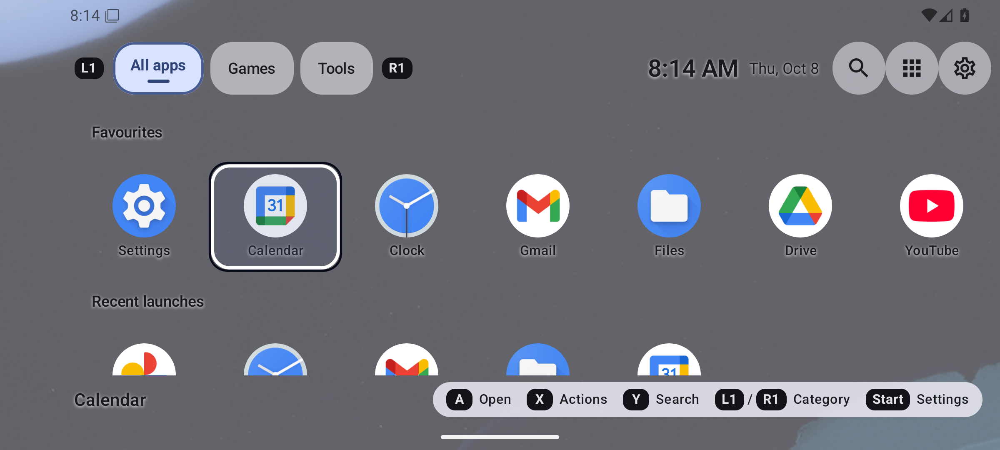
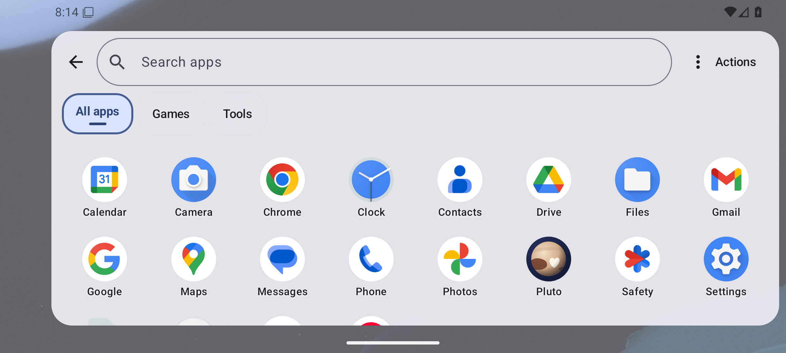

# Pluto

Pluto is an open-source, adaptive Android home screen. It is meant to be the one
launcher you keep full-time: an ordinary phone home screen when the phone is upright,
a comfortable touch layout when it is sideways, and a controller-driven "handheld"
front end when a gamepad is attached. Its icon is a small, Pluto-like dwarf planet.

The same apps, favourites, dock, folders and categories are shared by every
presentation, so rotating the phone or plugging in a controller never changes what
you have organised.

| Window    | Controller                 | Mode      |
|-----------|----------------------------|-----------|
| Portrait  | disconnected or connected  | Phone     |
| Landscape | disconnected               | Landscape |
| Landscape | connected                  | Handheld  |

Mode is chosen from the window shape, not from device orientation alone, and Handheld
can be forced on or turned off in Settings.

> Status: **0.1 prototype.** Release 0.1 is gated on an acceptance suite that has not yet
> been run on the reference hardware (OnePlus Nord 5 + GameSir controller). See
> [docs/ACCEPTANCE.md](docs/ACCEPTANCE.md) and [docs/KNOWN_ISSUES.md](docs/KNOWN_ISSUES.md).

## Features in 0.1

- **Three modes**: Phone (clock, favourites grid, folders, bottom dock), Landscape (compact
  header, wider grid, side or bottom dock chosen by available space) and Handheld (selected
  tile, category tabs, favourites row, Recent launches row, persistent button legend).
- **App library** for the personal profile via `LauncherApps`; updates live on install,
  update, uninstall, suspend and unsuspend. App identity is component + user profile.
- **Drawer and search**: alphabetical list, optional category filter, local search by name
  or package that is case- and accent-insensitive, with an empty state and a Clear control.
- **Favourites and dock**: pin/unpin, up to five dock slots, shared by portrait and landscape.
- **Folders**: create, rename, delete, reorder, move apps in and out. Deleting a folder never
  uninstalls anything.
- **Categories**: built-in All apps, Games and Tools, plus your own; an app can belong to
  several. Games are assigned manually.
- **Edit mode** with explicit Move up / Move down / Move before / Move after controls, so
  organising works with touch or a controller and without drag and drop.
- **Hidden apps** with a management screen to restore them (organisation, not security).
- **Recent launches**: the last 12 distinct apps launched from Pluto, with Clear history and
  Disable history (disabling deletes stored records and stops collection).
- **Controller navigation**: spatial D-pad / left-stick focus with dead zone and controlled
  repeat, duplicate key/axis suppression, remappable buttons (per controller), diagnostics.
- **Rotation preference**: Follow system, Portrait, Landscape, or Landscape when a controller
  is connected. Applies to the launcher window only.
- **Appearance**: system/light/dark theme, wallpaper contrast scrim, icon and text size
  (on top of Android's non-linear font scaling), reduced motion (removes scroll, ripple and
  switch animations; Android's "Remove animations" is honoured too).
- **App actions by touch**: tap **Actions** in All apps and then an app, or use Edit home
  (**Add favourite…**, **App actions…**). Pressing and holding an app is a shortcut to the
  same menu; controllers use X.
- **Accessibility**: screen-reader labels, 48 dp touch targets, no gesture-only or
  long-press-only actions, content beneath dialogs hidden from screen readers.
- **First-run setup**: usable default layout, optional category setup, controller preview,
  then the system default-Home chooser.

## Motion

All motion uses the shared tokens in `ui/motion/MotionTokens.kt` (springs for anything
spatial, short tweens for fades) and follows Reduce motion and Android's animator scale.

- **Drawer**: one continuous position drives the drawer, the receding home and the scrim,
  whether it is pulled by a finger, opened by a button or controller Y, or closed with
  Back / Home. The closed drawer stays composed off screen (built up a few tiles per frame
  while idle), so opening it only moves a layer.
- **Layers** (drawer, folders, sheets, pages, onboarding) move in the draw phase only
  (`drawMotion`), so a moving layer never makes Compose recompute the bounds of every tile
  inside it. Panels are opaque, and home is not drawn beneath the drawer panel.
- **Controller focus**: a single ring glides between controls. Up/Down inside app grids
  moves by row in a remembered column, so a held D-pad keeps its column while the grid
  scrolls.
- **App launch**: the tapped tile grows into a veil that covers the screen before the app
  starts. Stock Android also scales the app window up from the tile; OxygenOS replaces that
  with its own fade, and the veil keeps the hand-off visible there.
- **Search**: results swap in place (old ones fade out, then new ones fade in) instead of
  flying across the grid; Clear fades the full list back in.

On the reference phone, a **debug** build is noticeably slower than a release build: the
debuggable runtime interprets much of the code. Judge smoothness on a release build
(`./gradlew assembleRelease`; it is signed with the local debug key and installs over a
debug build, keeping your data).

## Screenshots

Taken on the Android 36 emulator (1080 x 2400, 420 dpi, gesture navigation) with a few
favourites pinned and the dock filled. Hardware screenshots from the reference phone are
still to come.

| Phone mode (portrait) | All apps drawer |
| --- | --- |
|  |  |

Landscape mode (touch): compact header, wider grid and a side dock.


Handheld mode with a controller connected: category tabs, Favourites and Recent launches
rows, the selected app (Calendar) and the button legend.



Drawer in landscape:



## Building

Requirements:

- JDK 17
- Android SDK with platform 36 (compileSdk / targetSdk 36; minSdk 30, Android 11)
- No other tooling; the Gradle wrapper downloads Gradle.

```sh
# Point Gradle at your SDK (or set ANDROID_HOME)
echo "sdk.dir=$ANDROID_HOME" > local.properties

./gradlew assembleDebug
# -> app/build/outputs/apk/debug/app-debug.apk

adb install -r app/build/outputs/apk/debug/app-debug.apk
```

Then press Home on the device and choose Pluto, or follow [docs/SETUP.md](docs/SETUP.md).

## Tests

```sh
# JVM unit tests: mode resolution, search, sorting, reorder, history, stick repeat, dedupe ...
./gradlew testDebugUnitTest

# Instrumented tests on a connected device or emulator, including Room migration tests
./gradlew connectedDebugAndroidTest
```

Hardware behaviour (controller mappings, OxygenOS Home transitions, rotation, reconnects)
cannot be certified by an emulator; see [docs/CONTROLLER_TESTS.md](docs/CONTROLLER_TESTS.md)
and [docs/ACCEPTANCE.md](docs/ACCEPTANCE.md).

## Privacy

Pluto works entirely on the device and offline. It has no account, no ads, no analytics
SDK, no cloud sync and no network permission. Your organisation and launch history are
stored only in the app's private storage (Android backup is disabled), and launch history
can be cleared or disabled at any time.

Pluto does not request usage access, notification access, accessibility access or overlay
permission. The only declared permission is `REQUEST_DELETE_PACKAGES`, used solely for the
optional Uninstall action, which always goes through Android's own confirmation dialog.
Becoming the default Home app uses Android's system role flow.

Work profiles and Private Space are **not supported** in 0.1: their apps are never listed,
searched, pinned or recorded, and Pluto says so in Settings.

## Documentation

- [docs/SETUP.md](docs/SETUP.md): install, first launch, default Home, switching back,
  controllers, rotation
- [docs/ARCHITECTURE.md](docs/ARCHITECTURE.md): modules, state model, focus, persistence and
  migrations
- [docs/ACCEPTANCE.md](docs/ACCEPTANCE.md): 0.1 acceptance tests and performance targets
- [docs/CONTROLLER_TESTS.md](docs/CONTROLLER_TESTS.md): controller test plan and results template
- [docs/KNOWN_ISSUES.md](docs/KNOWN_ISSUES.md): known issues and limitations

## Licence

Pluto is released under the [MIT License](LICENSE).
Copyright (c) 2026 Pluto contributors. The project contains no proprietary game artwork or
other unlicensed assets; please keep it that way in contributions.
